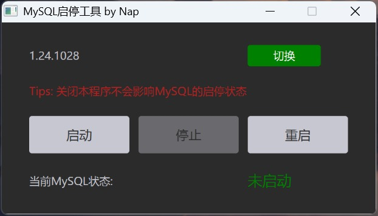
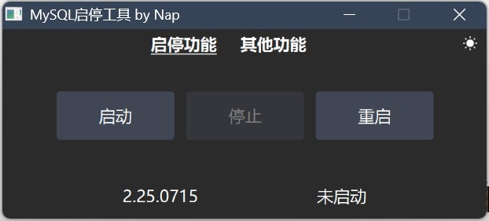
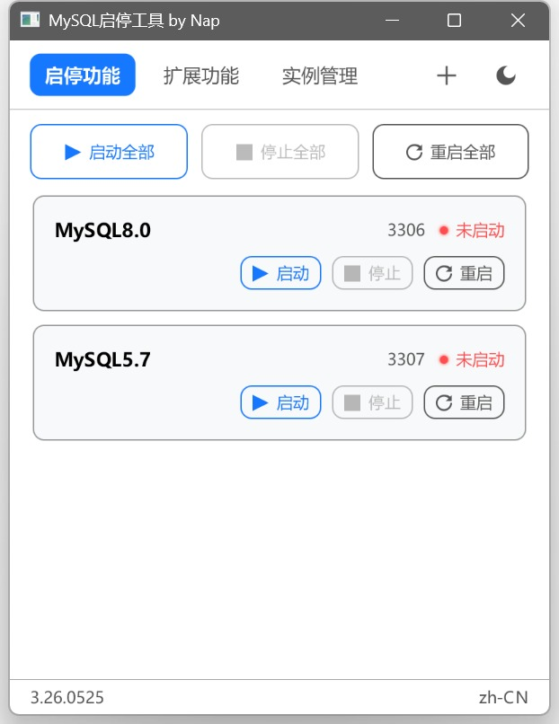
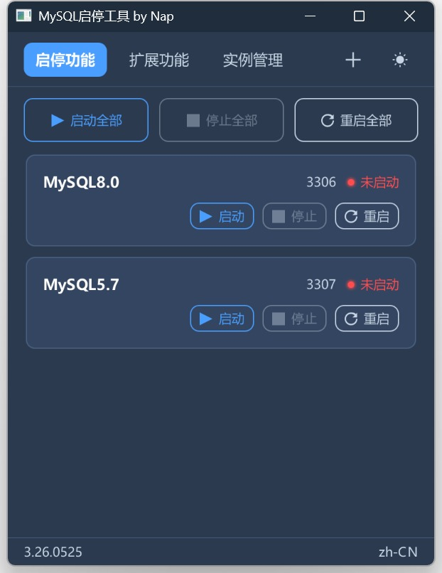

## NapMysqlTool

### UI 演变

**1.x** — 简陋的 UI，只有一种模式

**2.x** — 新增暗黑模式、i18n 国际化、启停导入导出功能优化，UI 初步美化

**3.x** — 现代化卡片式 UI，按实例管理支持同时管理多个实例，修复上一版启动失败的各种问题，启动速度提升

### 常见启动失败问题

1. **缺少 VC++ 运行库** — MySQL 依赖此库，不安装会导致启动报错。工具已自带，在 `mysql-lib/` 目录下
2. **端口被占用** — 之前装过 MySQL 并注册了系统服务，开机自启占用了 3306 端口，需手动关掉服务自启
3. **下载不完整** — 部分人只下了 `NapMysqlTool.exe`，缺少以下文件：
   - `jre/` Java 运行环境
   - `mysql-5.7.44-winx64/` MySQL 5.7
   - `mysql-8.0.39-winx64/` MySQL 8.0
   - `mysql-lib/` MySQL 依赖库
   - `NapMysqlTool.exe` 可执行文件
4. **未正常停止就关机** — 下次开机 MySQL 无法启动，到扩展功能里点"修复"即可

> 以上问题 3.x 均已解决

### 构建环境 (full-jfx21-nativeimage 分支)

本分支使用 Liberica Native Image Kit Full 版本进行 Native Image 打包，替代原先的 Java 8 + 自带 JavaFX + exe4j 方案。

**所需工具：**

1. **[Liberica Native Image Kit Full 23.1.11+1 x86 64-bit](https://bell-sw.com/pages/downloads/native-image-kit/?version=23&version-annual=21&vtabs=true)** — 下载页面选择 **Full** 版本（自带 JavaFX 和 Native Image），安装后确保 `bin` 目录已加入 `PATH`
2. **[Visual Studio](https://visualstudio.microsoft.com/zh-hans/downloads/)** — 需安装 **MSVC v143 生成工具**（含 `vcvarsall.bat`），Native Image 编译依赖 MSVC 工具链

> `native/build-native.ps1` 脚本会自动调用 `vcvarsall.bat` 初始化 MSVC 环境